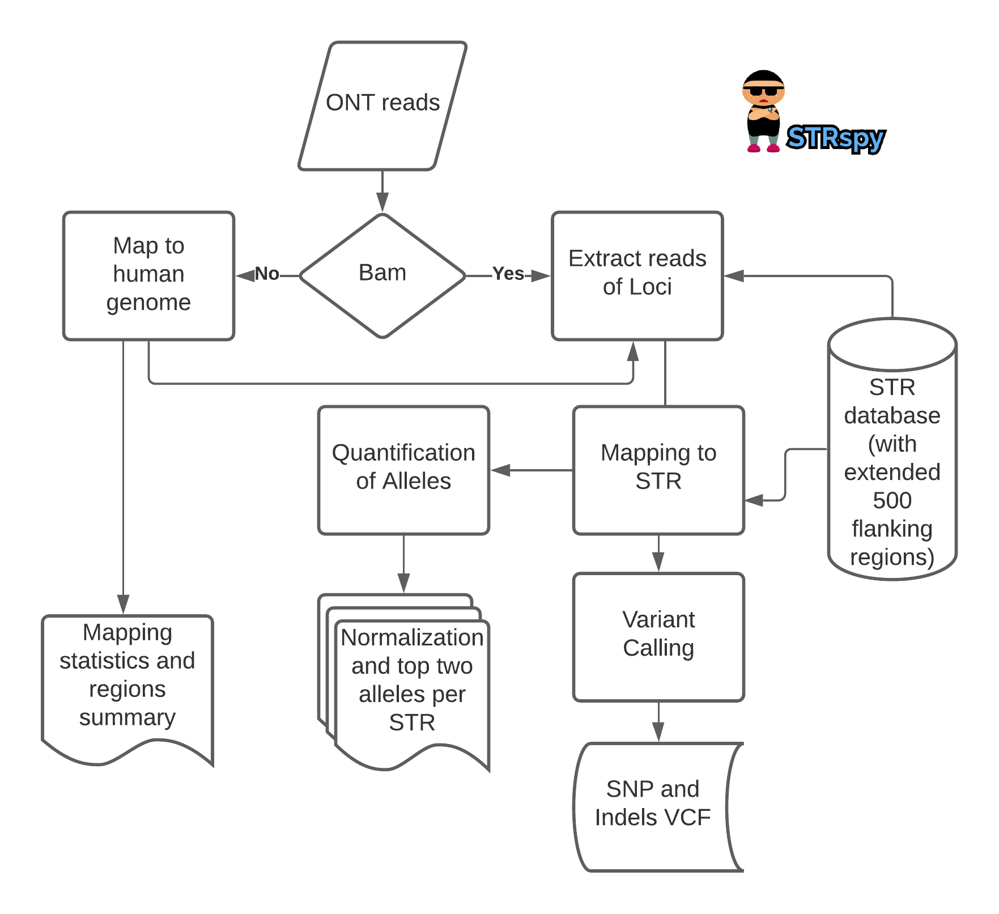

# strspy

STRspy: a novel alignment and quantification-based state-of-the-art method, short tandem repeat (STR) detection calling tool designed specifically for long-read sequencing reads such as from Oxford nanopore technology (ONT) and PacBio.

## Overview

DNA evidence has long been considered the gold standard for human identification in forensic investigations. Most often, DNA typing exploits the high variability of short tandem repeat (STR) sequences to differentiate between individuals at the genetic level. Comparison of STR profiles can be used for human identification in a wide range of forensic cases including homicides, sexual assaults, missing persons, and mass disaster victims. The number of contiguous repeat units present at a given microsatellite locus varies significantly among individuals, and thus make them useful for human identification purposes. Here, we are presents a complete pipeline i.e STRspy to identify STRs in a long read samples i.e. Oxford nanopore sequencing reads and Pacbio reads.

## Key Features

1. Input either fastq (raw reads usually from ONT) or bam (pre-aligned reads usually froom PacBio)
2. Reports raw counts of allele along with its Normalized counts by its maximum value
3. Find top two significant Alleles (filtering threshold set by user such as 0.4)
4. Detects Small variants such as SNP and Indels
5. Reports mapping summary and STR region of overlaps
6. Stutters analysis for simple motifs of STRs

## Installation

STRspy includes the installation of the following third-party software before it can be used.

`gnu parallel >=20210222`

`samtools >=v1.12`

`bedtools >=v2.30.0`

`minimap2 >=v2.18-r1015`

`xatlas >=v0.2.1`

### Clone the repository

`git clone git@github.com:unique379r/strspy.git`

`cd strspy`

### Create an environment

`bash setup/STRspy_setup.sh`

### Activate the environment

`conda activate strspy_env`

### Set up configuration

`bash setup/MakeToolConfig.sh`

`mv UserToolsConfig.txt config/`

### deactivate the environment

`conda deactivate`

## Quickstart

Modify the configfiles describing your data `config/InputConfig.txt`

## Run STRspy

`cd strspy`

`bash ./STRspy_run_v1.0.sh -h`

`USAGE: bash ./STRspy_run_v1.0.sh config/InputConfig.txt config/ToolsConfig.txt`

## InputConfig.txt

INPUT_DIR	: A dir must have either fastq (Oxford nanopore genomic reads) or bam (aligned genomic reads such as from PacBio)

INPUT_BAM	: Given inputs are bam or fastq (yes or no)

READ_TYPE	: Sequencing Technology (ont or pb)

STR_FASTA	: A dir contains Fasta files for each STR region of interest [assimung it has flanking regions (+/-) of 500bp]

STR_BED 	: A dir contains Bed files for each STR region of interest [assimung it has flanking regions (+/-) of 500bp]

GENOME_FASTA: Genome fasta (hg19/hg38) must provide in case of fastq input.

REGION_BED	: All STr bed has to concatnated inot single bed file to calculate the coverage of it from the aligment sample file.

NORM_CUTOFF	: A normalization threshold is required to select top two allles of a STR

OUTPUT_DIR : A empty directory to write the results

## ToolsConfig.txt

BEDTOOLS 	=	../user/path/bedtools

MINIMAP 	=	../user/path/minimap2

SAMTOOLS 	=	../user/path/samtools

XATLAS 		=	../user/path/xatlas

PARALLEL 	=	../user/path/parallel

## Note
One may encounter with a bug that using wrapper (`STRspy_run_v1.0.sh`), STRspy parallel version may not able to communicate properly with "gnu parallel" and exit the workfow without mapping or further steps of the analysis. Solution to this, the user may either run the script directly from scripts/STRspy_v1.0.sh in the STRspy dir or modify the STRspy_run_v1.0.sh script and allow the nested loop version of the workflow, but bear in mind that this is a little slower than the parallel version.

## Contacts
bioinforupesh200 DOT au AT gmail DOT com
rupesh DOT kesharwani AT bcm DOT edu

